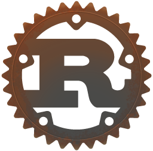
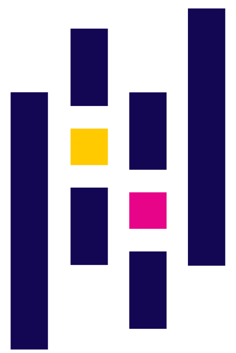

# Welcome to my space :smile:   Feel free to look around   I'll bring you some coffee :coffee:
## About me :bust_in_silhouette:

- 26 yo [he/him] from :brazil:;
- :zap: Electrical Engineer by formation;
- :computer: Developer Enthusiast in the spare time;
- :microscope: Master Student of Electrical Engineering at UFCG;
- :headphones: Podcast addicted;

 

## Weapons of Choice :dagger::shield:

### Programming Languages

    

        
        
        
        
    

### Frameworks

    

        
        
        
        
        
    

### Editors

    

        
        
    

### Highlighted Works

__STILL ON PROGRESS :warning:__

### Find me here

    <a href="https://www.linkedin.com/in/ntimesgurgel"></img></a>
    <a href="https://twitter.com/ntimesgurgel"></img></a>

