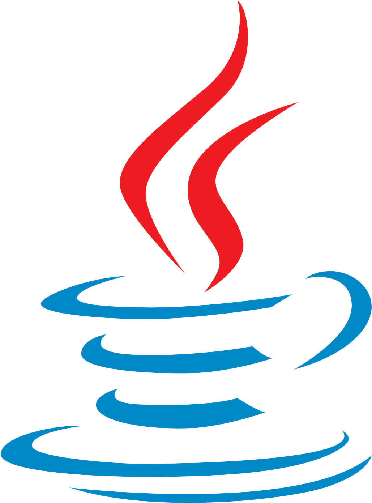

# Welcome to my space :smile:   Feel free to look around   I'll bring you some coffee :coffee:

<a href="https://www.linkedin.com/in/ntimesgurgel"></img></a>
<a href="https://twitter.com/ntimesgurgel"></img></a>

## About me :bust_in_silhouette:

- 26 yo [he/him] from :brazil:;
- :zap: Electrical Engineer by formation;
- :computer: Developer Enthusiast in the spare time;
- :microscope: Master Student of Electrical Engineering at UFCG;
- :headphones: Podcast addicted;

 

## Weapons of Choice :dagger::shield:

### Programming Languages

    

        </img>
        
Python

    

    

        </img>
        
Java

    

    

        </img>
        
Rust

        
To be learned

    

    

        </img>
        
Typescript

    

### Frameworks

    

        </img>
        
React

        
to be learned

    

    

        </img>
        
Django

        
to be learned

    

    

        </img>
        
Django

        
to be learned

    

    

        </img>
        
TensorFlow

        
to be learned

    

    

        </img>
        
Spring Boot

        
to be learned

    

### Editors

    

        </img>
        
VSCode

    

    

        </img>
        
VSCode

    

### Highlighted Works

__STILL ON PROGRESS :warning:__

<!--
**ntimesgurgel/ntimesgurgel** is a ✨ _special_ ✨ repository because its `README.md` (this file) appears on your GitHub profile.

Here are some ideas to get you started:

- 🔭 I’m currently working on ...
- 🌱 I’m currently learning ...
- 👯 I’m looking to collaborate on ...
- 🤔 I’m looking for help with ...
- 💬 Ask me about ...
- 📫 How to reach me: ...
- 😄 Pronouns: ...
- ⚡ Fun fact: ...
-->
